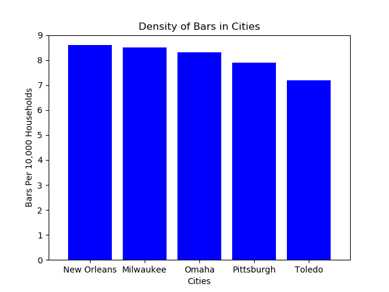

# Bars Bar Chart

In this activity, you will create a bar chart that visualizes the density of bars within major U.S. cities. It will resemble the following image: 

## Instructions:
    
1. Import dependencies.

2. Set the axes.

3. Create a bar chart based upon the data provided.

4. Create the ticks for the bar chart's x-axis.

5. Set the limits of the x- and y-axis.

6. Title the chart and the x and y label.

7. Save the image of the chart and print it to the screen.

8. **Optional:** If time permits navigate to [Matplotlib example visualizations](https://matplotlib.org/3.3.3/gallery/index.html) and look for a plot similar to what you have done and try to implement new features you find in the example code.
      
#### Hints:

* If needed, follow the comments provided in the Jupyter Notebook cells.

---

© 2021 Trilogy Education Services, a 2U, Inc. brand. All Rights Reserved.
