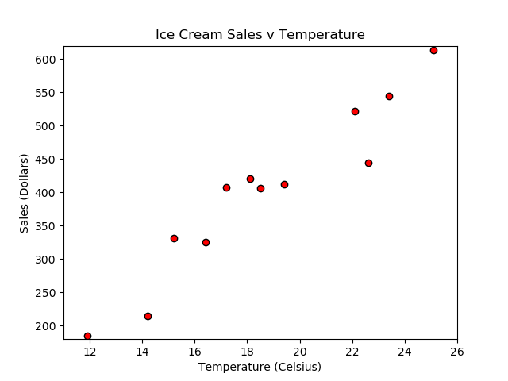

# Ice Cream Sales - Scatter Plot

---

#### Instructions:

1. Your final scatter plot should look like the image below: 

    

2. Create a scatter plot based on the temp and sales data.

3. Set the upper and lower limits of our y axis.

4. Set the upper and lower limits of our x axis.

5. Create a title, x label, and y label for the chart.

6. Save the chart image.

#### Bonus:

7. Create a new list called `scoop_price` with following values:

  * 89, 18, 10, 28, 79, 46, 29, 38, 89, 26, 45, 62

8. Create a scatter plot with followings:

  * Resize the dots based on the scoop price.
  
  * Set the dots to color blue.

  * Set the markers to circle.

9. Save the chart image.
